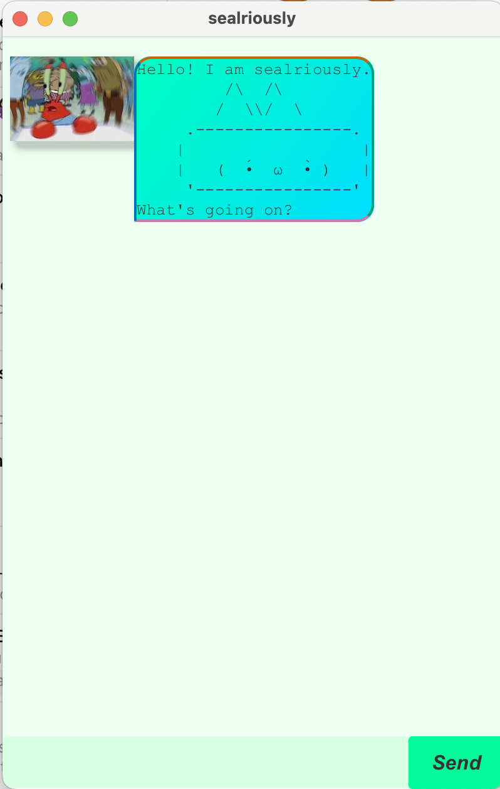

# sealriously

sealriously is a simple task manager chatbot that helps you manage todos, deadlines, and events efficiently.



---

## Getting Started

1. Launch the application.
2. Type a command in the input box.
3. Press Enter to execute the command.

---

## Commands

### list

Displays all current tasks.

```
list
```

---

### todo

Adds a todo task.

```
todo DESCRIPTION
```

Example:

```
todo read book
```

---

### deadline

Adds a deadline task with a due date and time.

```
deadline DESCRIPTION DUE: yyyy-MM-dd HHmm
```

Example:

```
deadline return book DUE: 2026-02-20 1800
```

---

### event

Adds an event task with a start and end date-time.

```
event DESCRIPTION START: yyyy-MM-dd HHmm DUE: yyyy-MM-dd HHmm
```

Example:

```
event meeting START: 2026-02-20 1400 DUE: 2026-02-20 1600
```

---

### mark

Marks a task as completed.

```
mark INDEX
```

Example:

```
mark 2
```

Note: Task index starts from 1.

---

### delete

Deletes a task.

```
delete INDEX
```

Example:

```
delete 3
```

Note: Task index starts from 1.

---

### find

Finds tasks containing a keyword.

```
find KEYWORD
```

Example:

```
find book
```

---

### tag

Adds a tag to a task.

```
tag INDEX #tag
```

Example:

```
tag 1 #important
```

Note: You can add multiple tags by running the `tag` command multiple times.

---

### bye

Exits the application.

```
bye
```

---

## Notes

- Date-time format must follow: `yyyy-MM-dd HHmm`
- Index numbering starts from 1.
- Commands are case-sensitive for keywords such as `DUE:` and `START:`.